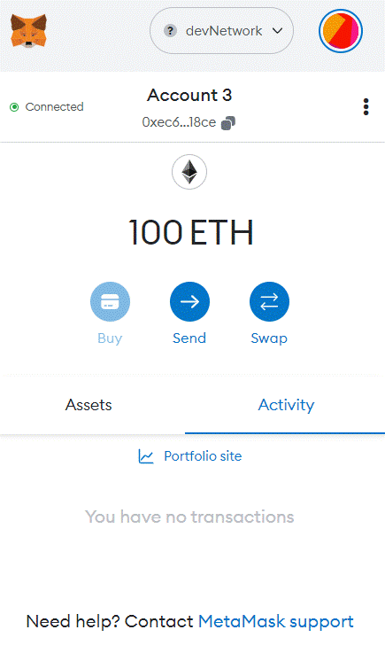
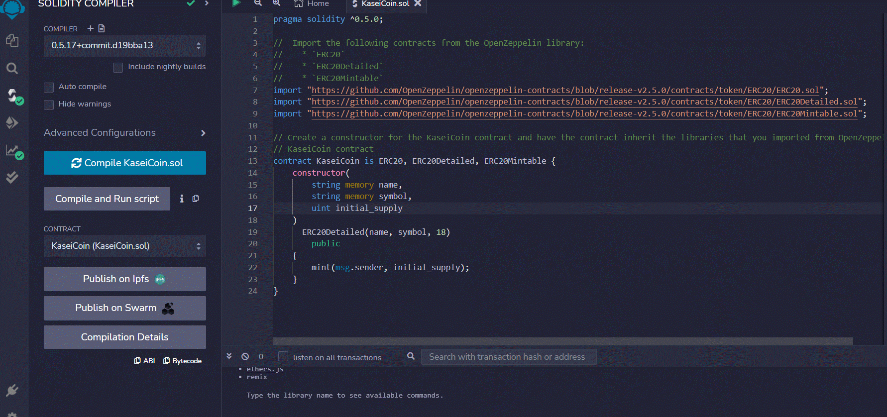
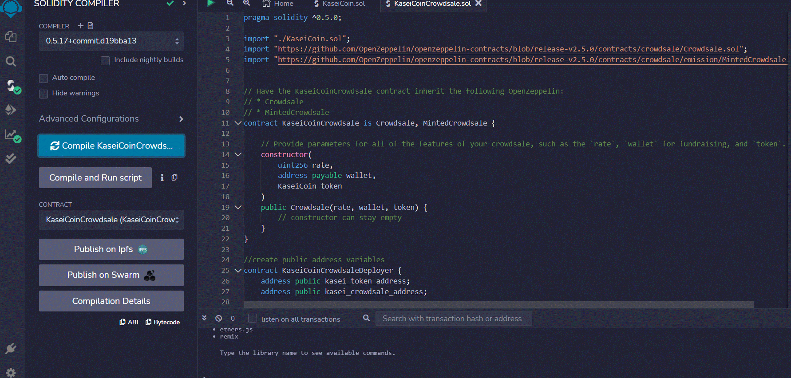
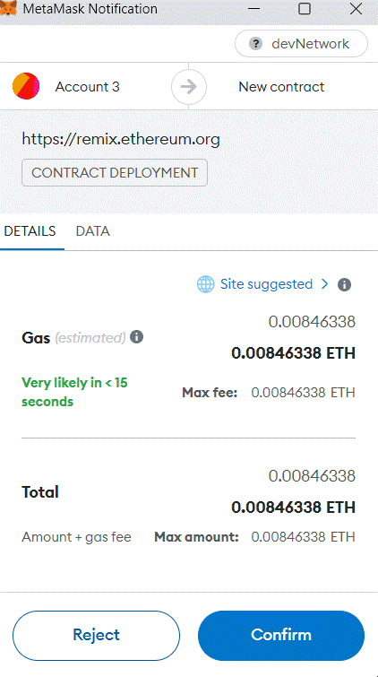

# kasei-coin

## Description
The objective of this project is to establish a crowdsale for a newly minted ERC-20 token named KaseiCoin. The contract for KaseiCoin is being developed in Remix, while Ganache is utilized to test it on a blockchain. To purchase tokens and sign transactions, the team will be utilizing the MetaMask wallet.

Initially, the team will create a MetaMask test network, following which they will import two accounts via private keys from Ganache to allow them to interact with the test network. Upon completion of this process, the MetaMask wallet will display a balance of 100 ETH by default, and should look similar to the image below:

The next task is to test the contracts. You can see below the KaseiCoin contract has been compiled successfully. 

Subsequently, it is important to confirm that the KaseiCoinCrowdsale contract and deployer compiles without any issues. You can see that in the imagine below. 

After finishing the task, our objective is to deploy the 'KaseiCoinCrowdsaleDeployer' contract. This will generate the two additional contracts simultaneously. To achieve this, we need to access the Deploy and run transactions section in Remix, in the enviroment drop-down section select the Injected Provider - MetaMask option, and in the contract drop-down menu select 'KaseiCoinCrowdsaleDeployer'. Upon selecting this option, MetaMask should automatically launch, and the window should appear as follows:

Make sure you hit the confirm button in MetaMask. Then you can head over to Ganache, where you should see the contract creation listed in your Transactions tab, as depicted in the image below.

Our contract is now set up for testing and interaction! As we enter the crowdfunding phase, we have various capabilities such as purchasing tokens, verifying the balance of different addresses (i.e., addresses that have bought tokens), reviewing the total amount of Wei raised, and checking the total supply, among others. As we carry out multiple transactions, the total supply can be observed below.

## Table of Contents

- [KaseiCoin](#kasei-coin)
    - [Description](#description)
    - [Table of Contents](#table-of-contents)
    - [1. Installation ](#1-installation)
    - [2. Usage](#2-usage)
    - [3. License](#3-license)
    - [4. Contributing](#4-contributing)
    - [5. Tests](#5-tests)
    - [6. Deployment](#6-deployment)
    - [7. Contact](#7-contact)
   

## 1. Installation 

If you would like to clone the repository, type "git clone https://github.com/arianamoreno13/kasei-coin.git. 
    
## 2. Usage    
Once you have cloned the repository to your local machine, you should install the packages listed under the "Installation" section. To accomplish this, activate your conda dev environment and execute the specified commands. 

- No further packages need to be installed.

After completing the installation process, refer to the "Deployment" section for instructions on how to view or modify the notebook.

## 3. License
    MIT License
Copyright (c) 2023 Ariana Moreno

Permission is hereby granted, free of charge, to any person obtaining a copy of this software and associated documentation files (the "Software"), to deal in the Software without restriction, including without limitation the rights to use, copy, modify, merge, publish, distribute, sublicense, and/or sell copies of the Software, and to permit persons to whom the Software is furnished to do so, subject to the following conditions:

The above copyright notice and this permission notice shall be included in all copies or substantial portions of the Software.

THE SOFTWARE IS PROVIDED "AS IS", WITHOUT WARRANTY OF ANY KIND, EXPRESS OR IMPLIED, INCLUDING BUT NOT LIMITED TO THE WARRANTIES OF MERCHANTABILITY, FITNESS FOR A PARTICULAR PURPOSE AND NONINFRINGEMENT. IN NO EVENT SHALL THE AUTHORS OR COPYRIGHT HOLDERS BE LIABLE FOR ANY CLAIM, DAMAGES OR OTHER LIABILITY, WHETHER IN AN ACTION OF CONTRACT, TORT OR OTHERWISE, ARISING FROM, OUT OF OR IN CONNECTION WITH THE SOFTWARE OR THE USE OR OTHER DEALINGS IN THE SOFTWARE.

## 4. Contributing

[Ariana Moreno](https://github.com/arianamoreno13)

## 5. Tests

- There is currently no tests associated with this project 

## 6. Deployment

At present, this app is not deployed on a shared server. To run the app, you need to upload the KaseiCoin.sol and KaseiCoinCrowdsale.sol files to the Remix IDE. After that, compile the contract and deploy it using Ganache and MetaMask. If the deployment is successful, you will be able to test the contract functions.

## 7. Contact

- [Ariana's Linkedin](www.linkedin.com/in/arianapmoreno)

